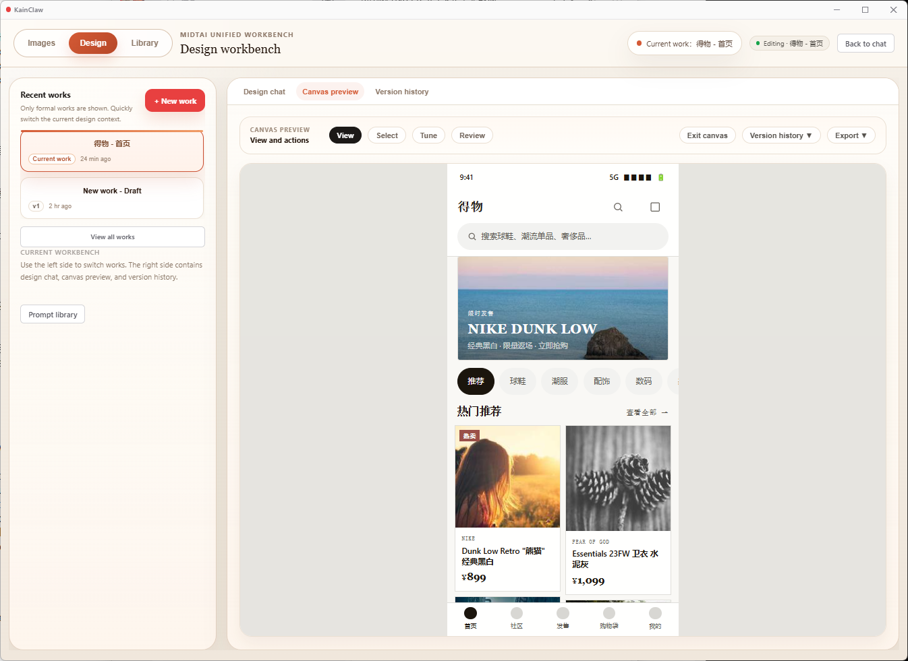

# KainClaw

English | [简体中文](README.zh-CN.md)

KainClaw is an early-stage AI coding and design assistant that runs as an Electron desktop app, with a VS Code extension mode kept for local development and validation.

The project is still in active development. Core workflows are usable, but some integrations and desktop surfaces are incomplete.

## Personal Note

KainClaw started as a personal vibe-coding project. I am not a professional programmer, product manager, or internet-industry practitioner; I only began seriously exploring Claude, ChatGPT, and AI-assisted development in January 2026. This project grew from that learning process and from a simple goal: make Claude-style coding and design workflows easier for more people to use.

The project is open source so others can inspect it, learn from it, improve it, and help shape a more accessible AI coding and design tool.

## Screenshots

**Gallery and image material library**


**Design version history**



## Features

**AI agent runtime**

- Multi-provider chat runtime with Anthropic, OpenAI, OpenAI-compatible endpoints, and Claude CLI support.
- Streaming conversations with persistent sessions, export/restore paths, transcript handling, and attachment normalization.
- Built-in agent roles for verification, code review, codebase exploration, and general-purpose task execution.
- Tool execution for workspace files, shell commands, browser-assisted flows, background tasks, and MCP tools.
- Approval, activity tracking, thinking/effort controls, fast mode, compact, micro-compact, and auto-compact support.
- Hooks, custom agents, skills, auto-memory extraction, user profile distillation, and swarm coordination where each parallel worker can run on a different configured provider alias.
- Early LSP and worktree runtime support for diagnostics, code navigation, and isolated task workspaces.

**Agent tools, planning, and automation**

- MCP configuration discovery from workspace files such as `.mcp.json` and `.cain-mcp.json`, including local command servers and remote HTTP servers.
- Workspace tools for listing, reading, searching, writing, and patching files, plus guarded PowerShell execution and allowlisted read-only commands.
- LSP tool operations for definitions, implementations, references, hover, symbols, diagnostics, and call hierarchy.
- Plan mode that creates a workspace plan file, keeps implementation read-only until the plan is approved, and verifies plan execution afterward.
- Structured task tools for creating, listing, updating, stopping, and inspecting foreground or background tasks.
- Background review and verification workers for longer-running checks without blocking the main chat loop.
- Multi-provider parallel execution through `spawn_agent`, `send_message`, and `wait_for_agents`, with up to 5 worker agents coordinated by the main conversation.
- Cron-style scheduled tasks with session-only or durable workspace-backed schedules.

**Context, memory, and extensibility**

- Session memory, auto-memory extraction, user profile storage, context mentions, workspace status, and conversation-scoped runtime state.
- Installed skills from user and project roots, including arguments, allowed tool mapping, model and effort overrides, forked execution, and skill-provided hooks.
- Custom agents, custom skills, teammate agents, prompt commands, inspection sessions, and companion responses.
- Hooks can run around tool usage, worktree lifecycle events, and installed skill flows.
- Session, settings, task, artifact, project, and version storage modules used by the Electron desktop app and development host.
- Local Bridge and Office Bridge foundations for future local connector, document, and desktop integration work.

**Artifacts and code intelligence**

- Artifact detection for HTML, SVG, Mermaid, and code blocks, including wrapped `<artifact>` payloads and markdown fence handling.
- Artifact registry and prompt augmentation for previewable outputs in the chat and design surfaces.
- Review and verification runners for code review, plan validation, and detached background checks.
- Browser runtime and fetch/search tools for web-assisted investigation and browser interaction flows.

**Design workbench**

- Chat-first design flow with a discovery form, visual direction picker, brand context handling, and HTML artifact generation.
- Design skill bundles for prototypes, slides, dashboards, reports, pricing pages, landing pages, mobile screens, social carousels, email layouts, infographics, posters, and motion concepts.
- Skill bundles can include `SKILL.md`, `template.html`, `layouts.md`, and `checklist.md`, so generation starts from a concrete design system instead of a blank prompt.
- Built-in craft rules for typography, OKLch color tokens, layout rhythm, anti-slop constraints, and output-type-specific design posture.
- Project-bound design drafts, version history, patching, slider extraction, local previews, thumbnails, and exports to HTML, ZIP, and PPTX-oriented workflows.

**Image lab**

- Image generation and edit workflows with prompt inference, reference image handling, material search keywords, and workflow orchestration.
- Prompt library storage, built-in prompt presets, batching helpers, sizing logic, result gallery, and local gallery persistence.
- OpenAI image client support plus provider-aware routing for models that can infer prompts from reference images.

**Desktop and integration surfaces**

- Electron desktop shell for chat, design workbench, image workflows, provider settings, project navigation, and local persistence.
- VS Code extension mode remains available for development-host validation and compatibility testing.
- Word Add-in prototype for document context and write-back experiments.
- Platform boundaries are reserved for desktop automation, browser bridge, scheduler/cron, local connectors, and future Windows client packaging.

## Independent Project Notice

KainClaw is an independent open-source project developed by its contributors.

This project is not affiliated with, endorsed by, or maintained by Anthropic, OpenAI, Microsoft, or any other provider mentioned in this repository. Product names and trademarks belong to their respective owners.

KainClaw does not include proprietary provider source code, model weights, or private service assets. Provider integrations are implemented through public APIs, local CLIs, or user-configured compatible endpoints.

## Design Workflow Attribution

KainClaw's design-system workflow is inspired by and partially adapted from [nexu-io/open-design](https://github.com/nexu-io/open-design).

The shared ideas are workflow-level rather than a product affiliation: design tasks are guided by composable skills, seed templates, layout references, checklists, visual direction presets, and design-system rules before final HTML artifacts are generated. KainClaw adapts those ideas into its own Electron desktop experience, provider runtime, project storage, chat flow, and local design workbench.

Some design direction logic and design prompt structure were adapted from Open Design's Apache-2.0-licensed implementation. See `THIRD_PARTY_NOTICES.md` for details.

## Status

KainClaw is not a polished production client yet. The Electron app is the recommended runtime for testing; the VS Code extension shape remains useful for local development.

Areas still under active development include:

- Tool runtime completeness
- Review and verification lifecycle
- Compact, transcript, and token lifecycle
- LSP and worktree depth
- Browser bridge and desktop automation wiring
- Office integration beyond the current Word prototype
- Desktop UI for skills, agents, hooks, and settings
- Test coverage and release packaging

## Requirements

- Node.js 24+
- npm
- Windows is recommended for the current Electron desktop workflow
- VS Code is only needed if you want to run the legacy extension development host

## Current Installation Status

KainClaw does not provide a signed public installer yet. For now, the recommended way to try it is to run the Electron desktop app from source.

Prebuilt releases and a simpler installer flow are planned after the desktop package is stable.

## Run Options

Choose one of the following paths.

**Option 1: Run directly from source**

This is the fastest path for developers and early testers.

```bash
git clone https://github.com/cain0501/kainclaw.git
cd kainclaw
npm install
npm run start:electron
```

**Option 2: Build a local Windows installer**

Use this if you want to generate a Windows desktop package from the source code.

```bash
git clone https://github.com/cain0501/kainclaw.git
cd kainclaw
npm install
npm run dist:win
```

Run the VS Code extension development host:

1. Open this repository in VS Code.
2. Press `F5`.

## Validate For Development

```bash
npm test
npm run check
npm run build
npm run build:electron
```

## Provider Configuration

The app supports provider configuration through the settings UI. Environment variables are also supported for local development and compatibility with existing workspaces.

Common variables:

| Provider | Variables |
| --- | --- |
| Anthropic | `ANTHROPIC_API_KEY`, `ANTHROPIC_AUTH_TOKEN`, `ANTHROPIC_MODEL`, `ANTHROPIC_BASE_URL` |
| OpenAI / compatible | `OPENAI_API_KEY`, `OPENAI_MODEL`, `OPENAI_BASE_URL` |
| Generic fallback | `LLM_PROVIDER`, `LLM_API_KEY`, `LLM_MODEL`, `LLM_BASE_URL` |

Do not commit real account credentials, API keys, tokens, or private local configuration.

## MCP Configuration

KainClaw looks for MCP configuration in workspace files such as:

- `.mcp.json`
- `.cain-mcp.json`

Both `mcpServers` and `servers` top-level shapes are supported.

Example:

```json
{
  "mcpServers": {
    "my-server": {
      "command": "npx",
      "args": ["-y", "my-mcp-package"]
    }
  }
}
```

Remote HTTP servers can be configured with `url` and `headers`.

## Development Notes

The desktop shell should stay thin. New product logic should usually live in reusable modules under `src/`, with Electron wiring used for desktop UI, IPC, permissions, and host integration.

High-risk areas to edit carefully:

- `src/extension.ts`
- `src/webviewHtml.ts`
- `electron/ElectronChatPanel.ts`
- `electron/renderer/index.html`
- `src/license/licenseManager.ts`

Run the relevant build and tests after changing these paths.

## Contributing

Contributions are welcome while the project is stabilizing.

Before opening a pull request:

1. Keep the change focused.
2. Reuse existing runtime and host boundaries where possible.
3. Avoid adding new dependencies unless the need is clear.
4. Run:

```bash
npm test
npm run check
npm run build
```

For Electron renderer changes, also run:

```bash
npm run build:electron
```

## License

MIT. See `LICENSE`.

This repository also includes Apache-2.0-licensed design workflow material adapted from Open Design. See `THIRD_PARTY_NOTICES.md`.
