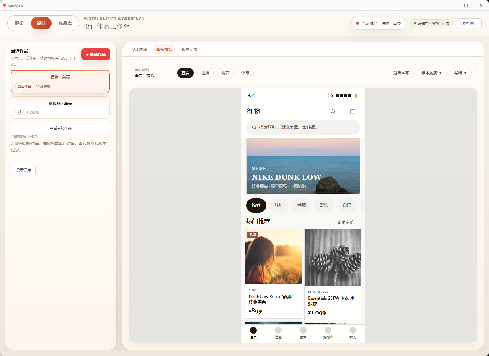

# KainClaw

[English](README.md) | 简体中文

KainClaw 是一个早期阶段的 AI 编程与设计助手。当前主要以 Electron 桌面应用运行，同时保留 VS Code 扩展模式用于本地开发和验证。

项目仍在活跃开发中。核心流程已经可用，但部分集成能力和桌面端界面仍不完整。

## 个人说明

KainClaw 最初是一个个人 vibe coding 项目。我不是职业程序员，也不是产品经理，现在也不是互联网从业者；我是从 2026 年 1 月才开始正式接触 Claude、ChatGPT 和 AI 辅助开发。这款应用是在学习和尝试的过程中慢慢做出来的，最初的目标也很简单：让更多人能更容易地使用 Claude 风格的编程和设计工作流。

我把项目开源，是希望大家可以检查、学习、改进它，也一起把 AI 编程和 AI 设计工具做得更容易使用。

## 截图

**作品库与图片素材库**


**设计工作台**



## 功能

**AI Agent 运行时**

- 支持 Anthropic、OpenAI、OpenAI 兼容端点和 Claude CLI 的多 Provider 对话运行时。
- 流式会话、会话持久化、导出/恢复、transcript 处理和附件标准化。
- 内置 verification、code review、codebase exploration 和 general-purpose task agent。
- 支持工作区文件、Shell 命令、浏览器辅助流程、后台任务和 MCP tools。
- 支持审批流、活动追踪、thinking/effort 控制、fast mode、compact、micro-compact 和 auto-compact。
- 支持 hooks、自定义 agents、skills、auto-memory 提取、用户画像蒸馏，以及 swarm 协调；每个并行 worker 都可以绑定不同的已配置 Provider alias。
- 早期 LSP 与 worktree 运行时，用于诊断、代码导航和隔离任务工作区。

**Agent 工具、计划模式与自动化**

- 可从 `.mcp.json`、`.cain-mcp.json` 等工作区文件发现 MCP 配置，支持本地 command server 和远端 HTTP server。
- 工作区工具支持列文件、读文件、搜索、写入、局部替换，以及带审批保护的 PowerShell 执行和白名单只读命令。
- LSP 工具支持定义跳转、实现、引用、hover、symbols、diagnostics 和 call hierarchy。
- Plan mode 会在工作区生成计划文件，计划获批前保持只读，之后可验证执行结果。
- 结构化任务工具支持创建、列出、更新、停止和查看前台/后台任务。
- 后台 review / verification worker，可执行较长时间的检查，不阻塞主聊天循环。
- 通过 `spawn_agent`、`send_message` 和 `wait_for_agents` 实现多 Provider 并行执行，主会话最多可协调 5 个 worker agents。
- Cron 风格定时任务，支持仅当前会话生效或持久化到工作区。

**上下文、记忆与扩展能力**

- 支持 session memory、auto-memory 提取、用户画像存储、context mentions、工作区状态和会话级运行状态。
- 支持从用户目录和项目目录加载 installed skills，包括参数、allowed tools 映射、模型/effort 覆盖、forked execution 和 skill hooks。
- 支持自定义 agents、自定义 skills、teammate agents、prompt commands、inspection sessions 和 companion responses。
- Hooks 可围绕工具调用、worktree 生命周期和 installed skill 流程触发。
- 会话、设置、任务、artifact、项目和版本存储模块，为 Electron 桌面端和开发宿主共用。
- Local Bridge 与 Office Bridge 基础能力，为后续本地连接器、文档和桌面集成预留边界。

**Artifacts 与代码智能**

- 支持识别 HTML、SVG、Mermaid 和代码块 artifact，包括 `<artifact>` 包裹内容和 markdown fence。
- Artifact registry 与 prompt augmentation 支撑聊天和设计界面的可预览输出。
- Review / verification runner 可用于代码审查、计划验证和后台 detached checks。
- Browser runtime 与 fetch/search tools 支持网页辅助调查和浏览器交互流程。

**设计工作台**

- 以对话为入口的设计流程，支持 discovery form、视觉方向选择、品牌上下文处理和 HTML artifact 生成。
- 设计 skill bundles 覆盖 prototype、slide、dashboard、report、pricing page、landing page、mobile screen、social carousel、email、infographic、poster 和 motion concept。
- 每个 skill bundle 可包含 `SKILL.md`、`template.html`、`layouts.md` 和 `checklist.md`，让生成从具体设计系统出发，而不是只靠一句 prompt。
- 内置字体、OKLch 配色 token、布局节奏、anti-slop 约束和不同输出类型的设计姿态规则。
- 支持项目绑定的设计草稿、版本历史、局部 patch、slider 提取、本地预览、缩略图，以及 HTML、ZIP、PPTX 方向的导出流程。

**图像实验室**

- 支持图像生成和图像编辑工作流，包括 prompt 推断、参考图处理、素材搜索关键词和工作流编排。
- 支持 Prompt Library、本地 prompt 预设、批量辅助、尺寸推断、结果图库和本地图库持久化。
- 支持 OpenAI image client，并根据 Provider 能力判断是否可从参考图推断 prompt。

**桌面端与集成界面**

- Electron 桌面壳承载聊天、设计工作台、图像流程、Provider 设置、项目导航和本地持久化。
- VS Code 扩展模式仍保留，用于开发宿主验证和兼容性测试。
- Word Add-in 原型用于文档上下文读取和写回实验。
- 已为桌面自动化、浏览器桥接、scheduler/cron、本地连接器和未来 Windows 客户端打包预留平台边界。

## 独立项目声明

KainClaw 是由贡献者开发的独立开源项目。

本项目不隶属于 Anthropic、OpenAI、Microsoft 或本仓库中提到的其他 Provider，也未获得这些主体的认可、背书或维护。相关产品名称和商标归各自权利人所有。

KainClaw 不包含任何 Provider 的专有源代码、模型权重或私有服务资产。Provider 集成通过公开 API、本地 CLI 或用户自行配置的兼容端点实现。

## 设计工作流来源与致谢

KainClaw 的设计系统工作流参考并部分改编自 [nexu-io/open-design](https://github.com/nexu-io/open-design)。

两者共享的是工作流层面的思路，不代表项目从属或产品关联：设计任务会先经过可组合 skills、种子模板、布局参考、检查清单、视觉方向预设和设计系统规则，再生成最终 HTML artifact。KainClaw 将这些思路适配到了自己的 Electron 桌面体验、Provider 运行时、项目存储、聊天流程和本地设计工作台中。

部分设计方向逻辑和设计 prompt 结构改编自 Open Design 的 Apache-2.0 许可实现。详见 `THIRD_PARTY_NOTICES.md`。

## 当前状态

KainClaw 还不是完整的正式客户端。当前推荐使用 Electron 应用进行测试；VS Code 扩展形态主要用于本地开发。

仍在推进的方向包括：

- 工具运行时完整性
- Review 和 Verification 生命周期
- Compact、transcript 和 token 生命周期
- LSP 与 worktree 深度能力
- 浏览器桥接和桌面自动化接线
- Word 原型之外的 Office 集成
- Skills、agents、hooks 和设置的桌面端 UI
- 测试覆盖和发布打包

## 环境要求

- Node.js 24+
- npm
- 当前 Electron 桌面流程推荐在 Windows 上运行
- 只有需要运行旧的 VS Code 扩展开发宿主时，才需要 VS Code

## 当前安装状态

KainClaw 目前还没有提供已签名的公开安装包。现阶段推荐从源码启动 Electron 桌面应用进行试用。

等桌面端打包流程稳定后，会再提供预构建 release 和更简单的安装方式。

## 运行方式

你可以按自己的需要选择下面任意一种方式。

**方式一：直接从源码运行**

适合开发者和早期试用者，这是最快的方式。

```bash
git clone https://github.com/cain0501/kainclaw.git
cd kainclaw
npm install
npm run start:electron
```

**方式二：构建本地 Windows 安装包**

如果你希望从源码生成 Windows 桌面安装包，可以使用这个方式。

```bash
git clone https://github.com/cain0501/kainclaw.git
cd kainclaw
npm install
npm run dist:win
```

运行 VS Code 扩展开发宿主：

1. 用 VS Code 打开本仓库。
2. 按 `F5`。

## 开发验证

```bash
npm test
npm run check
npm run build
npm run build:electron
```

## Provider 配置

应用支持通过设置界面配置 Provider。为了方便本地开发和兼容已有工作区，也支持环境变量。

常见变量：

| Provider | 变量 |
| --- | --- |
| Anthropic | `ANTHROPIC_API_KEY`, `ANTHROPIC_AUTH_TOKEN`, `ANTHROPIC_MODEL`, `ANTHROPIC_BASE_URL` |
| OpenAI / 兼容接口 | `OPENAI_API_KEY`, `OPENAI_MODEL`, `OPENAI_BASE_URL` |
| 通用兜底 | `LLM_PROVIDER`, `LLM_API_KEY`, `LLM_MODEL`, `LLM_BASE_URL` |

不要提交真实账号凭据、API key、token 或私有本地配置。

## MCP 配置

KainClaw 会在工作区中查找 MCP 配置文件，例如：

- `.mcp.json`
- `.cain-mcp.json`

支持 `mcpServers` 和 `servers` 两种顶层结构。

示例：

```json
{
  "mcpServers": {
    "my-server": {
      "command": "npx",
      "args": ["-y", "my-mcp-package"]
    }
  }
}
```

远端 HTTP 服务可以通过 `url` 和 `headers` 配置。

## 开发说明

桌面壳应保持轻量。新的产品逻辑通常应放在 `src/` 下的可复用模块中，Electron 侧主要负责桌面 UI、IPC、权限和宿主集成。

高风险文件：

- `src/extension.ts`
- `src/webviewHtml.ts`
- `electron/ElectronChatPanel.ts`
- `electron/renderer/index.html`
- `src/license/licenseManager.ts`

修改这些路径后，应运行相关构建和测试。

## 贡献

项目仍在稳定阶段，欢迎贡献。

提交 Pull Request 前：

1. 保持改动聚焦。
2. 优先复用已有 runtime 和 host 边界。
3. 除非必要，不要新增依赖。
4. 运行：

```bash
npm test
npm run check
npm run build
```

如果修改 Electron renderer，也运行：

```bash
npm run build:electron
```

更多说明见 `CONTRIBUTING.md`。

## 许可证

MIT。详见 `LICENSE`。

本仓库也包含从 Open Design 改编的 Apache-2.0 许可设计工作流材料。详见 `THIRD_PARTY_NOTICES.md`。
